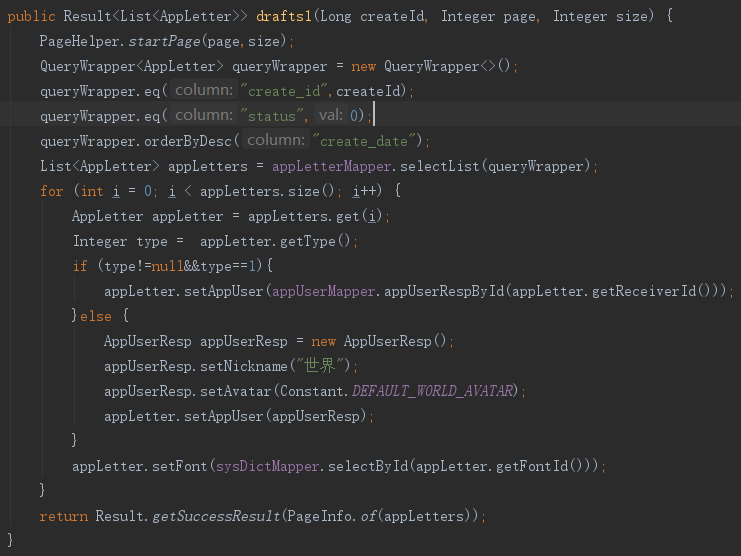
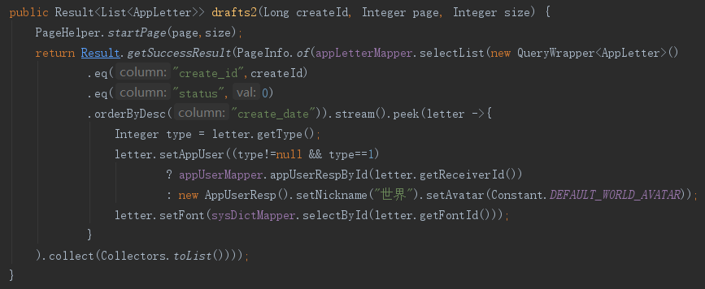
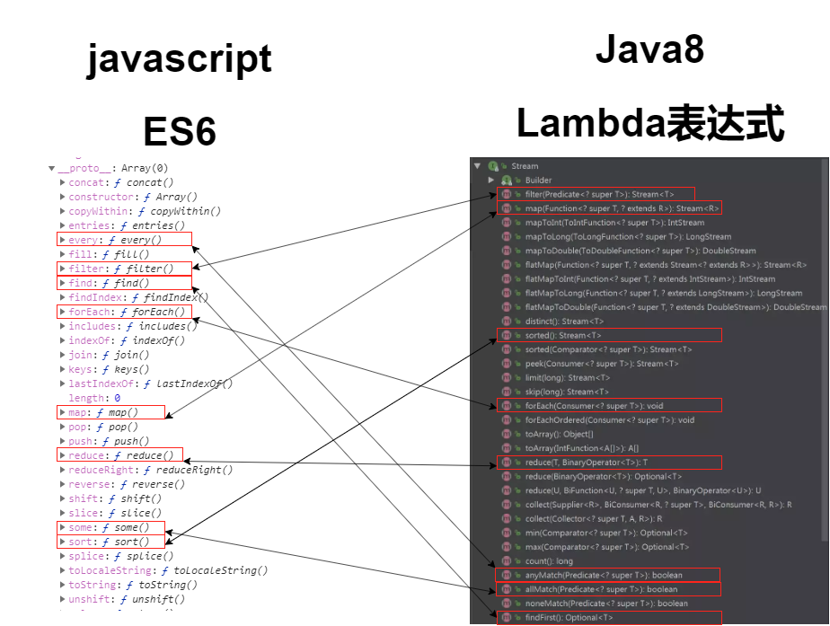

# Java8 VS ES6【循环篇】

> 友情提示：java8和ES6的内容很多，本文简单介绍几个方法。来替代项目中的for循环


#### B站视频教程

#### [https://www.bilibili.com/video/av86795917](https://www.bilibili.com/video/av86795917)


## 前言

这里展示两段代码，具体代码没什么意义，主要看代码的行数，与结构

使用Lambda表达式之前



使用Lambda表达式之后



有木有精简很多！！！有木有逼格高了很多！！！有木有看不懂了很多！！！
<!--more-->


为啥要把Java8Lambda和ES6箭头函数联系在一起说呢？

因为他们真的太像了，虽然java和javascipt就像是老婆和老婆饼一样没什么关系的两个语言。

但他们却又很多地方都是神类似的。


来看看Lambda和ES6的到底有哪些一样的方法?



##### 这些方法实现的功能几乎一毛一样滴，so，一次学习两边受用。


## java8新特性【循环篇】

### 准备工作

创建一个Main类，在类中添加如果下代码，此方法主要用于替代 System.out.println输出信息

后面的所有  log()==System.out.println();

```java
//System.out.println的简化版
public static void log(Object object) {
    System.out.println(object);
}
```

###  Lambda 表达式  基础用法说明

> jdk1.8之前的函数式接口有哪些？
> java.lang.Runable
> java.util.concurrent.Callable<V>
> java.util.Comparator<T>
>
> 
>
> jdk1.8之后的函数式接口有哪些？
> Supplier  				  一个输出
> Consumer	  		  一个输入
> BiConsumer			两个输入
> Function				   一个输入，一个输出（类型可能不同）
> BiFunction			   两个输入，一个输出（类型可能不同）
> UnaryOperator	   一个输入，一个输出（输入输出的类型是一致的）
> BiaryOperator		 两个输入，一个输出（输入输出的类型是一致的）

### 练习1  Lambda 表达式  基础用法

```java
	public static void testLambda1() {
		Supplier<Integer> f1 = () ->{return 100;};//只有返回值没有输入
		Supplier<String> f2 = () -> {return "返回值";};
		log(f1.get());
		log(f2.get());
        
		Consumer<String> f3 = (arg)->{log(arg);};//只有输入没有返回值
		f3.accept("输入");
        
		Consumer<String> f4 = arg->log(arg);  //只有一个参数一行语句时可省略参数的()和返回值的{}
		f4.accept("输入");
        
		Function<String, Integer> f5 = arg -> arg.length();//一个输入参数一个返回值
		log(f5.apply("输入"));
        
		BiFunction<String, String, Integer> f6 = 
            (arg1,arg2)->arg1.length()+arg2.length();//两个输入一个返回值
		log(f6.apply("aa", "bbb"));
        
		new Thread(()->log("子线程输出语句"));//创建一个子线程输出一句话
		System.out.println("主线程输出语句");
	}
```

### 练习2    ::的方法的使用

```java
	public static void testLambda2() {
        //Supplier的中文意思是提供，对应的用法是  无参有返回值
		Supplier<String> f1 = Main::test1;
		System.out.println(f1.get());
		
        //Consumer的中文意思是消费，对应的用法是  有参无返回值
		Consumer<String> f2 = Main::test2;
		f2.accept("传入参数");
        
        //function的中文意思是函数，对应的用法是 一个参数，有返回值
		Function<String, String> f3 = Main::test3;
		log(f3.apply("传入参数"));
        
        //function的中文意思是函数，对应的用法是 二个参数，有返回值
		BiFunction<String, String, String> f4 = Main::test4;
		log(f4.apply("参数1", "参数2"));
    }
	public static String test1() {
		return "aa";
	}
	public static void test2(String args) {
		log(args);
	}
	public static String test3(String args) {
		log(args);
		return "返回值";
	}
	public static String test4(String arg1,String arg2) {
		log(arg1+"|"+arg2);
		return "返回值";
	}
```

### 练习3 Stream  Api的基础用法

```java
public static void streamApi() {
		
		log("stream1------------");
		String[] arr = {"a","b","c"};
		Stream<String> stream1 = Stream.of(arr);//数组转Stream  
		stream1.forEach(Main::log);//便利输出每一个元素

		
		log("stream2------------");
		List<String> list = Arrays.asList("1","2","3");
		Stream<String> stream2 = list.stream();//List转Stream  
		stream2.forEach(Main::log);//便利输出每一个元素

		
		log("stream3------------");
		Stream<String> stream3 = Stream.generate(()->"a");//生产"a"的字符串
		stream3.limit(5).forEach(Main::log);//limit是截取，截取并输出

		log("stream4------------");
		Stream<Integer> stream4 = Stream.iterate(1, x->x+1);//迭代器，从1开始,一次+1,类似i++
		stream4.limit(5).forEach(Main::log);//limit是截取，截取并输出
		
		log("stream5------------");
		String str = "abc";
		IntStream stream5 = str.chars();//字母变成了对应的字符编码
//		stream5.forEach(item -> System.out.println(item));//lambda箭头函数写法
//		stream5.forEach(System.out::println);//lambda方法体只有一句话时的简写形式
		stream5.forEach(Main::log);//由于本类中又静态的log输出方法，所以可以这样写
    	
	}

```

### Stream中有很多API，可大致分为两类。

一种是返回值依然是Stream对象的。如下

> 过滤filter
>
> 去重distinct
>
> 排序sorted
>
> 截取limit、skip
>
> 转换map/flatMap
>
> 窥视peek

另一种是没有返回的。如下

> 循环forEach
>
> 计算min、max、count、average
>
> 匹配anyMatch、allMath、noneMathch、findFirst、findAny
>
> 汇集reduce
>
> 收集器toArray   collect

### 练习4 Stream  Api实战

准备两个对象，此处省略了get set方法

```java
class User {
	String username;
	String password;
}
class Person {
	String name;
	String nikename;
	int age;
}
```

测试代码

```java
	public static void streamApiActualCombat() {
		
		//例子0  使用filter方法取偶数
		log("例子0  使用filter方法取偶数--------------------------------------------");
		Arrays.asList(1,2,3,4,5,6,7).stream().filter(item -> item%2==0).forEach(Main::log);
		/*
		 * 先使用Arrays.asList把一堆元素变成一个List，然后获取stream对象，调用filter方法
		 * filter方法于forEach类似的一点，也是每次拿一个元素，也是会把所有的元素便利一遍
		 * 每次执行时判断条件是否成立最后返回true或false;
		 * 最后过滤好剩余的元素其实还在stream中，
		 * 如果需要，可以使用.collect(Collectors.toList())进行收集，返回一个List
		 * 也可以直接foreach输出。
		 * */
		
		//例子1  字符串转换Map
		log("例子1 字符串转换Map--------------------------------------------");
		String queryString = "itemId=1&userId=10000&type=20&token=1111111&key=index";
		Map<String, String> param = Stream.of(queryString.split("&"))
				.map(str -> str.split("="))
				.collect(Collectors.toMap(s->s[0], s->s[1]));
		log(param);
		
		//例子2 list重构
		log("例子2 list重构--------------------------------------------");
		List<User> users = new ArrayList<>();
		users.add(new User("张三","123456"));
		users.add(new User("李四","123456"));
		users.add(new User("张三","123456"));
		users.add(new User("赵六","123456"));
        users.forEach(Main::log);
		
		//例子3 list重构，只获取username字段，并重组
		log("例子3 list重构，只获取username字段，并重组--------------------------------------------");
		List<String> names  = users.stream().map(u->u.getUsername()).collect(Collectors.toList());
		names.forEach(Main::log);
		
		//例子4 list重构，只获取username字段，并重组
		log("例子4 list重构，只获取username字段，并重组--------------------------------------------");
		List<String> pass  = users.stream().map(u->u.getPassword()).collect(Collectors.toList());
		pass.forEach(Main::log);
		
		//例子5 数组聚合，name转User对象
		log("例子5 数组聚合，name转User对象--------------------------------------------");//两个数组重构成一个数组，前提需要有相应的临时包装类
		List<JSONObject> users2 = Stream.iterate(0, i -> i + 1).limit(names.size()).map(i->{
			String name = names.get(i);
			String password = 1000+""+i;
			User user = new User(name,password);
//			return user;
			JSONObject jo = new JSONObject();
			jo.put(name, names.get(i));
			jo.put("password", 1000+""+i);
			jo.put("index", i);
			return jo;
		}).collect(Collectors.toList());
		log(users2);
		
		//例子6重构时同时去重
		log("例子6 重构时同时去重--------------------------------------------");
		List<String> namesSingle  = users.stream().map(u->u.getUsername()).distinct().collect(Collectors.toList());
		namesSingle.forEach(Main::log);
		
		//例子7 使用普通的set去重
		log("例子7 使用普通的set去重--------------------------------------------");
		Set<String> nameSet = names.stream().collect(Collectors.toSet());
		nameSet.forEach(Main::log);
		
		//例子8 使用普通的set去重
		log("例子8 数组聚合简单版，user转map--------------------------------------------");
		Map<String,User> map =  userSimple.stream().collect(Collectors.toMap(user->user.getUsername(), user->user));
		log(map);
		
		//例子9 根据username统计User列表
		log("例子9 根据username统计User列表--------------------------------------------");
		Map<String, Long> map2 = users.stream().collect(Collectors.groupingBy(User::getUsername,Collectors.counting()));
		log(map2);
		
		//例子10 根据年龄字段获取年龄最大的那个对象
		log("例子10 根据年龄字段获取年龄最大的那个对象--------------------------------------------");
		List<Person> persons = new ArrayList<>();
		persons.add(new Person("张三","张三丰",18));
		persons.add(new Person("张三","张三丰",18));
		persons.add(new Person("张三","张三丰",18));
		persons.add(new Person("李四","李四叔",33));
		persons.add(new Person("王五","王五弟",25));
		persons.add(new Person("赵六","昵称六",19));
		Optional<Person> maxAge = persons.stream().collect(Collectors.maxBy(Comparator.comparing(Person::getAge)));
		log(maxAge.get());
		
		//例子11 用name分组，然后根据同名的年龄和
		log("例子11 用name分组，然后根据同名的年龄和--------------------------------------------");
		Map<String, Double> map3 = persons.stream().collect(Collectors.groupingBy(Person::getName,Collectors.summingDouble(Person::getAge)));
		log(map3);
		
		//例子12 peek窥视(连续)操作
		log("例子12 peek窥视(连续)操作--------------------------------------------");
		String[] strings = {"a","bb","ccc","dddd","eeee"};
		Stream.of(strings).peek(Main::log)
            .filter(str->str.length()>3)
            .forEach(Main::log);
        
        
```


## ES6新特性【循环篇】

```html
<!DOCTYPE html>
<html>
<head>
<title>ES6数组</title>
<script type="text/javascript">
// ES6数组新添加的一些方法：
// arr.forEach()    //循环遍历
// arr.map()    //有返回值得遍历
// arr.filter() //过滤一个新数组
// arr.some()   //查找
// arr.every()  //满足
// arr.reduce() //一般叠加用
// arr.reduceRight()    //同上
 
// arr.find()   //查找,并返回符合条件的第一个对象,否则返回undefined
//类似arr.findIndex('str') 返回第一次出现的下标,否则返回-1 ES5老函数
 
//arr.fill('str',startindex,endindex);//在某个位置插入一个成员
//arr.includes()//数组查找某个成员是否存在 类似字符串中的includes函数 返回boolean
 
//for of [ES6版本] forEach的简化版
//for in [老版本] forEach的简化版
// java中的foreach;
// Python中的 for in;
// js 中的for of;遍历数组,set//for in遍历对象
 
// Array、Object、Set、Map四种数据结构中for、for in和for of循环的区别？
// 一、普通for循环在Array和Object中都可以使用。
// 二、for in在Array和Object中都可以使用。// 注意：在对象中包含原型上的属性。
// 三、for of在Array、Object、Set、Map中都可以使用。
// 四、forEach循环在Array、Set、Map中都可以使用。
 
 
// arr.forEach()
let arr=['apple','banana','orange','tomato'];
//传统写法
// for (var i = 0; i < arr.length; i++) {
// console.log(arr[i]);
// }
 
//ES6 forEach写法
//参数说明：forEach函数的参数一：是一个函数,参数二：方法内this指向(不常用) 如果不指定默认window
//forEach会向这个函数传入三个参数
//(当前值,当前下标,所在数组)
// arr.forEach(function(val,index,arr,tem){
// console.log(val,index,arr,tem);
// });
// 输出结果：
// apple 0 ["apple", "banana", "orange", "tomato"] undefined
// banana 1 ["apple", "banana", "orange", "tomato"] undefined
// orange 2 ["apple", "banana", "orange", "tomato"] undefined
// tomato 3 ["apple", "banana", "orange", "tomato"] undefined
 
//ES6 forEach+箭头函数写法
//参数说明：forEach函数的参数一：是一个函数,参数二：箭头函数时此参数无效
//forEach会向这个函数传入三个参数
//(当前值,当前下标,所在数组)
// arr.forEach((val,index,arr)=>{
// console.log(val,index,arr);
// });
// 输出结果：
// apple 0 ["apple", "banana", "orange", "tomato"]
// banana 1 ["apple", "banana", "orange", "tomato"]
// orange 2 ["apple", "banana", "orange", "tomato"]
// tomato 3 ["apple", "banana", "orange", "tomato"]
 
 
// arr.map()
// map的重要作用：重置数据结构 //map没有返回值得时候和forEach()方法一模一样
//有返回值的时候 是每个function都会返回一个值,最终形成一个数组,返回
//let newarr=arr.forEach()//返回的是undefined
//let newarr=arr.map()//返回的是每个function 返回值 组成的数组(可能是普通数组,也可以能对象数组)
let arr2=[
{title:'aaaaa',read:100,hot:true},
{title:'bbbbb',read:100,hot:true},
{title:'ccccc',read:100,hot:true},
{title:'ddddd',read:100,hot:true}
];
let newarr2=arr2.map((item,index,arr)=>{
//console.log(item,index);
return {
index:index,
title:item.title,
read:item.read,
hot:item.hot
}
});
console.log(newarr2);
//总结map的重要作用：重置数据结构
//用需要返回值用map不需要返回值用forEach
 
 
//arr.filter()
//主要作用：过滤 返回值 true||false true留下 false删除
// 最后返回一个过滤好的新数组
let arr3=[
{title:'aaaaa',read:100,hot:true},
{title:'bbbbb',read:100,hot:false},
{title:'ccccc',read:100,hot:true},
{title:'ddddd',read:100,hot:false}
];
let newarr3=arr3.filter((item,index,arr)=>{
//console.log(item,index);
return item.hot;
});
console.log(newarr3);
 
 
//arr.some() //子函数返回 boolean 最后根据boolean数组||运算 即只要一个满足就返回true
//arr.every() //子函数返回 boolean 最后根据boolean数组&&运算 即必须每一个满足才返回true
 
let arr4=[1,2,3,4,5,6,7,8,9,10];
let res1=arr4.reduce((pre,cur,idnex,arr)=>{//会传一个上一个元素的值
return pre+cur;
});
console.log(res1);//55
 
let arr5=[1,2,3,4,5,6,7,8,9,10];
let res2=arr5.reduceRight((pre,cur,idnex,arr)=>{//同上,但是这个是从右往左遍历数组
return pre+cur;
});
console.log(res2);//55
 
 
// Array.find()//查找 参数是一个函数,函数做判断条件满足条件就返回当前对象,如果没找到,返回 undefined
let arr7=[23,900,102,80];
let res=arr7.find((val,index,arr)=>{
return val>100;
});
console.log(res);//返回第一个符合条件的
 
 
//ES6.2(ES8) 2017版本
//幂运算符2**3 相同与 Math.pow(2,3);
 
//for of
let arr6=["apple", "banana", "orange", "tomato"];
 
for(let val of arr6){
console.log(val);
}
 
//这是一种错误的写法,因为有了上面的下方,所以下面的这个不存在的
// for(let val of arr6.values()){
// console.log(val);
// }
 
for(let index of arr6.keys()){
console.log(index);
}
 
for(let item of arr6.entries()){
console.log(item);
}
 
for(let [key, val] of arr6.entries()){ //解构写法
console.log(key,val);
}
 
//----------------------------------------------------------------------------------------
//数组其他知识：
// Array.from()
 
let jsonstr={
8:'aaaaaa',
6:'bbbbbb',
2:'cccccc',
3:'dddddd',
length:10
}
let newarr=Array.from(jsonstr);
console.log(newarr);
 
// Array.of()//把多个值合并成一个数组 Array.of(1,2,3) 返回[1,2,3]
 
/*------------------------------------------------------------
一个很帅很装逼却没有什么用的知识点：
Array.from() //参数：类数组 返回一个数组
把一个类似数组的对象转换成数组
//from转换的关键在于 预转换的对象内是否有length这个属性 和属性的key
只有满足有lenth这个属性,而且key 为整形才行
let json={
0:'aaaa',
1:'bbbb'
}
let newarr=Array.from(json);//newarr 为 []
let jsonstr={
8:'aaaaaa',
6:'bbbbbb',
2:'cccccc',
3:'dddddd',
length:10
}
let newarr=Array.from(jsonstr);
console.log(newarr);//newarr 为
[undefined, undefined, "cccccc", "dddddd", undefined, undefined, "bbbbbb", undefined, "aaaaaa", undefined]

------------------------------------------------------------*/
</script>
</head>
<body>
 
</body>
</html>
```

ES6原文链接

[https://www.cnblogs.com/bigfire/p/9518100.html](https://www.cnblogs.com/bigfire/p/9518100.html)


## 总结：

**优点：**

1. 简洁。

2. 非常容易并行计算。

3. 可能代表未来的编程趋势。

4. 结合 hashmap 的 computeIfAbsent 方法，递归运算非常快。java有针对递归的专门优化。

**缺点：**

1. 若不用并行计算，很多时候计算速度没有比传统的 for 循环快。（并行计算有时需要预热才显示出效率优势）

2. 不容易调试。

3. 若其他程序员没有学过 lambda 表达式，代码不容易让其他语言的程序员看懂。

4. 在 lambda 语句中强制类型转换貌似不方便，一定要搞清楚到底是 map 还是 mapToDouble 还是 mapToInt

