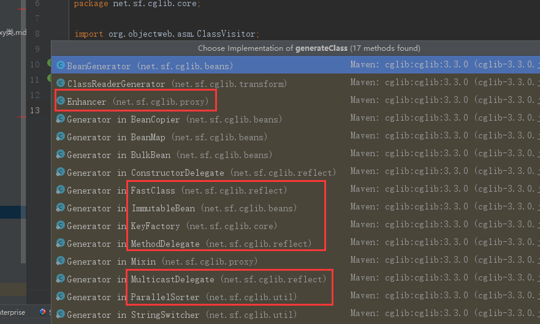

### CGlib代码跟读

enhancer.create();

return this.createHelper();

Object result = super.create(key);

data = new AbstractClassGenerator.ClassLoaderData(loader);

Class klass = gen.generate(ClassLoaderData.this);

gen = classLoader.loadClass(this.getClassName());

byte[] b = this.strategy.generate(this);

DefaultGeneratorStrategy.java

public byte[] generate(ClassGenerator cg)
   this.transform(cg).generateClass(cw);

public interface ClassGenerator {
    void generateClass(ClassVisitor var1) throws Exception;
}

然后点击左侧选择具体某个类的生成方式，如图：
<!--more-->

CGlib代码跟读

#### 两个顺序

1.主要分析Class对象的生成方式，和byte[]的生成过程

2.主要是分析CGLib的调用方法和JDK的区别，JDK的反射和CGlib实现的动态代理性能上差在哪里了?。FastClass机制到底为啥就比反射快了。

#### 其中性能上比较

自己写的Proxy类

先拼接java文件

编译成class文件【非常耗时】

再通过反射机制生成对象【较为耗时】

最终实现了动态代理的效果

JDK的Proxy类

JDK的根据class文件的格式，拼接byte[]数组加载生成Class

然后使用反射机制生成对象【较为耗时】

最终实现了动态代理的效果

 

CGLib的Proxy类

直接使用asm构造出符合class格式的byte[]数组加载生成Class

然后使用FastClass机制生成对象【耗时很小】

最终实现了动态代理的效果

 

源码阅读可参考博文

[代理文集](https://www.jianshu.com/nb/11960632)

[cglib 动态代理原理分析](https://www.cnblogs.com/cruze/p/3865180.html)

