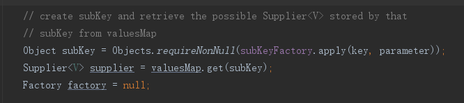
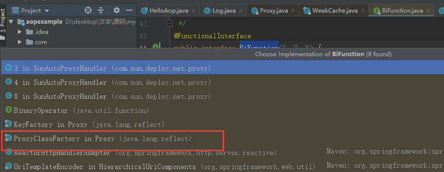
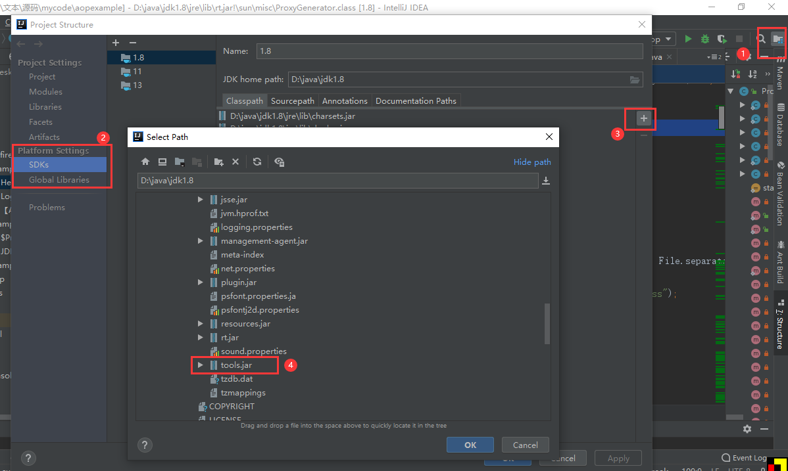

# 【AOP系列】JDK动态代理源码分析(三)


这里通过JDK的源码来查看一下JDK动态代理的实现。


### 输出Class文件

我们尝试把JDK动态生成的$Proxy0的class给生成出来。
<!--more-->

```java
public class JDKAop {

    //当前项目目录
    private static String userDir = System.getProperty("user.dir");
    private static String pack = JDKAop.class.getPackage().getName();//当前包
    private static String packPath = pack.replace(".","/");
    private static String envDir = "/src/main/java/"; //环境目录
    private static String currPackPath = userDir  + envDir + packPath;//当前包的绝对路径

    public static void main(String[] args)throws Throwable {
        //这里用的Log类和上一个例子中用到的是同一个
        List<String> aoplist = (List)Proxy.newProxyInstance(null, new Class[]{List.class}, new Log(new ArrayList<>()));
        //ProxyGenerator.generateProxyClass是JDK提供的一个方法，
        //可以生成某个接口的代理类  并返回字节码数组
        byte[] classFile = ProxyGenerator.generateProxyClass("$Proxy0", new Class[]{List.class});
        //我们把这个字节码数组写到当前目录下的文件中，方便查看
        FileOutputStream fos = new FileOutputStream(currPackPath + "/$Proxy0.class");
        fos.write(classFile);
        fos.flush();

    }
    
}
```


### $Proxy0

生成的委托类的.class文件反编译后的代码

```java
//代理类都继承 Proxy 类 并且实现代理接口List
public final class $Proxy0 extends Proxy implements List {
	//内部其实村的是一堆的Method对象。
    private static Method m1;
    private static Method m3;
	//......此处省略几十行类似的代码

	//构造函数的入参为 例子中InvokerHandler的实例
	//也就是 Proxy.newProxyInstance(classLoader,{List.class},handler); 的入参 handler
    public $Proxy0(InvocationHandler var1) throws  {
        super(var1);//调用父类的构造函数，父类中会执行 this.h = h;及下文中用到的this.h.invoke
    }
    /*
    Proxy类中的代码
   	protected Proxy(InvocationHandler h) {
        Objects.requireNonNull(h);
        this.h = h;
    }
    */

    public final boolean equals(Object var1) throws  {
        try {
            return (Boolean)super.h.invoke(this, m1, new Object[]{var1});
        } catch (RuntimeException | Error var3) {
            throw var3;
        } catch (Throwable var4) {
            throw new UndeclaredThrowableException(var4);
        }
    }
    
    public final void add(int var1, Object var2) throws  {
        try {
            super.h.invoke(this, m4, new Object[]{var1, var2});
        } catch (RuntimeException | Error var4) {
            throw var4;
        } catch (Throwable var5) {
            throw new UndeclaredThrowableException(var5);
        }
    }
	//......此处省略几个类似的方法

	//静态块执行会先执行，所以对象初始化的时候会把上面的成员变量都初始化赋值。
    static {
        try {
        //由于List没有重写Object的equals，所以还是拿java.lang.Object的方法
            m1 = Class.forName("java.lang.Object").getMethod("equals", Class.forName("java.lang.Object"));
            //拿list的方法给m3赋值
            m3 = Class.forName("java.util.List").getMethod("add", Class.forName("java.lang.Object"));
        } catch (NoSuchMethodException var2) {
            throw new NoSuchMethodError(var2.getMessage());
        } catch (ClassNotFoundException var3) {
            throw new NoClassDefFoundError(var3.getMessage());
        }
    }
}
```

其中

```java
public final class $Proxy0 extends Proxy implements List
```

通过这行代码我们可以得到一下信息

- 1.既然他实现了List接口，那么我们当然可以用List来存放这个$Proxy的对象实例。

- 2.而且前面还生成了final,所以$Proxy也自然不会有子类了。

- 3.因为Java是单继承的，虽然不知道为啥要继承Proxy，但是这里既然继承了Proxy，那么$Proxy0就不能同时有其他的父类了。这里也**可能**是为啥JDK只能生成接口类型的派生类的原因，仅仅是可以能【先暂时放一下，后面自己实现一下JDK的动态代理试试，再详细分析】


### $Proxy0的详细生成过程

#### Proxy.newProxyInstance方法

```java
 public static Object newProxyInstance(ClassLoader loader,
                                          Class<?>[] interfaces,
                                          InvocationHandler h)
        throws IllegalArgumentException
    {
        Objects.requireNonNull(h);//非空检测

        final Class<?>[] intfs = interfaces.clone();//将接口Class数组克隆一份
        final SecurityManager sm = System.getSecurityManager();//调用系统的安全管理器
        if (sm != null) {
            checkProxyAccess(Reflection.getCallerClass(), loader, intfs);//检测ClassLoader
        }

        /*
         * Look up or generate the designated proxy class.
         * 查找或生成指定的代理类
         */
        Class<?> cl = getProxyClass0(loader, intfs);

        /*
         * Invoke its constructor with the designated invocation handler.
         * 使用指定的调用处理程序调用其构造函数。
         */
        try {
            if (sm != null) {
                checkNewProxyPermission(Reflection.getCallerClass(), cl);//检测新代理类的权限
            }
            //通过反射获取代理类的构造方法
            final Constructor<?> cons = cl.getConstructor(constructorParams);
            final InvocationHandler ih = h;
            if (!Modifier.isPublic(cl.getModifiers())) {
                AccessController.doPrivileged(new PrivilegedAction<Void>() {
                    public Void run() {
                        cons.setAccessible(true);
                        return null;
                    }
                });
            }
            return cons.newInstance(new Object[]{h});//返回一个代理类的对象
        } catch (IllegalAccessException|InstantiationException e) {
            throw new InternalError(e.toString(), e);
        } catch (InvocationTargetException e) {
            Throwable t = e.getCause();
            if (t instanceof RuntimeException) {
                throw (RuntimeException) t;
            } else {
                throw new InternalError(t.toString(), t);
            }
        } catch (NoSuchMethodException e) {
            throw new InternalError(e.toString(), e);
        }
    }
```

主要的几行代码

```java
//生成代理类
Class<?> cl = getProxyClass0(loader, intfs);
//通过反射获取代理类的构造器
final Constructor<?> cons = cl.getConstructor(constructorParams);
//使用反射拿到构造器对象后创建一个代理对象，并返回
return cons.newInstance(new Object[]{h});
```

进一步看一下getProxyClass0这个方法

```java
return proxyClassCache.get(loader, interfaces);
```

点击进入，其中调用了apply(key,parameter);





这里都不是关键的点，

#### 进入ProxyClassFactory类中

```java
private static final class ProxyClassFactory
        implements BiFunction<ClassLoader, Class<?>[], Class<?>>
    {
        // class名前缀
        private static final String proxyClassNamePrefix = "$Proxy";
        //$Proxy0,1,2,3
        private static final AtomicLong nextUniqueNumber = new AtomicLong();
        @Override
        public Class<?> apply(ClassLoader loader, Class<?>[] interfaces) {
			//定义给Map存放接口
            Map<Class<?>, Boolean> interfaceSet = new IdentityHashMap<>(interfaces.length);
            for (Class<?> intf : interfaces) {
          		//验证类加载器
                Class<?> interfaceClass = null;
                interfaceClass = Class.forName(intf.getName(), false, loader);
                if (interfaceClass != intf) {
                    throw new IllegalArgumentException(
                        intf + " is not visible from class loader");
                }
                //验证是否是接口
                if (!interfaceClass.isInterface()) {
                    throw new IllegalArgumentException(
                        interfaceClass.getName() + " is not an interface");
                }
                //验证重复的接口
                if (interfaceSet.put(interfaceClass, Boolean.TRUE) != null) {
                    throw new IllegalArgumentException(
                        "repeated interface: " + interfaceClass.getName());
                }
            }

            String proxyPkg = null;     // 包
            int accessFlags = Modifier.PUBLIC | Modifier.FINAL;//public final
			//拼接代理类的一些权限信息
            for (Class<?> intf : interfaces) {
                int flags = intf.getModifiers();
                if (!Modifier.isPublic(flags)) {
                    accessFlags = Modifier.FINAL;
                    String name = intf.getName();
                    int n = name.lastIndexOf('.');
                    String pkg = ((n == -1) ? "" : name.substring(0, n + 1));
                    if (proxyPkg == null) {
                        proxyPkg = pkg;
                    } else if (!pkg.equals(proxyPkg)) {
                        throw new IllegalArgumentException(
                            "non-public interfaces from different packages");
                    }
                }
            }

            if (proxyPkg == null) {
                proxyPkg = ReflectUtil.PROXY_PACKAGE + ".";
            }

            //名字递增
            long num = nextUniqueNumber.getAndIncrement();
            String proxyName = proxyPkg + proxyClassNamePrefix + num;
            
            //生成代理类的字节数组
            byte[] proxyClassFile = ProxyGenerator.generateProxyClass(
                proxyName, interfaces, accessFlags);
            //用JDK内部的ClassLoader将byte数组加载到内存，如何成功，则返沪Class对象    
			return defineClass0(loader, proxyName,proxyClassFile, 0,proxyClassFile.length);

        }
    }
```

##### 其中主要做了一下几件事情

- 1.一些规则检测，如类加载器是否有效，Class是否为接口，接口数组中的接口是否有重复等

- 2.拼接代理需要的一些信息，如类名$Proxy+递增数字

- 3.代理类的byte[]生成

- 4.加载byte[]到内存，并返回Class

接下来我们看一下byte[]是怎么生成的

#### ProxyGenerator.generateProxyClass();

（如果点击无法进入，需要添加JDK中的tool.jar，如图所图所示）



进入后主要的两行代码

```java
ProxyGenerator var3 = new ProxyGenerator(var0, var1, var2);
final byte[] var4 = var3.generateClassFile();
```

#### 进入generateClassFile()方法

```
private byte[] generateClassFile() {
        this.addProxyMethod(hashCodeMethod, Object.class);//添加hashCode代理方法
        this.addProxyMethod(equalsMethod, Object.class);//添加equals代理方法
        this.addProxyMethod(toStringMethod, Object.class);//添加toString代理方法
        Class[] var1 = this.interfaces;
        int var2 = var1.length;

		//循环添加代理方法
        int var3;
        Class var4;
        for(var3 = 0; var3 < var2; ++var3) {
            var4 = var1[var3];
            Method[] var5 = var4.getMethods();
            int var6 = var5.length;

            for(int var7 = 0; var7 < var6; ++var7) {
                Method var8 = var5[var7];
                this.addProxyMethod(var8, var4);//循环添加代理方法
            }
        }

        Iterator var11 = this.proxyMethods.values().iterator();

        List var12;
        while(var11.hasNext()) {
            var12 = (List)var11.next();
            checkReturnTypes(var12);//循环检测返回值类型
        }

        Iterator var15;
        try {
            this.methods.add(this.generateConstructor());
            var11 = this.proxyMethods.values().iterator();
			//循环生成方法
            while(var11.hasNext()) {
                var12 = (List)var11.next();
                var15 = var12.iterator();

                while(var15.hasNext()) {
                    ProxyGenerator.ProxyMethod var16 = (ProxyGenerator.ProxyMethod)var15.next();
                    this.fields.add(new ProxyGenerator.FieldInfo(var16.methodFieldName, "Ljava/lang/reflect/Method;", 10));
                    this.methods.add(var16.generateMethod());
                }
            }
			//添加静态初始化方法
            this.methods.add(this.generateStaticInitializer());
        } catch (IOException var10) {
            throw new InternalError("unexpected I/O Exception", var10);
        }

        if (this.methods.size() > 65535) {
            throw new IllegalArgumentException("method limit exceeded");
        } else if (this.fields.size() > 65535) {
            throw new IllegalArgumentException("field limit exceeded");
        } else {
            this.cp.getClass(dotToSlash(this.className));
            this.cp.getClass("java/lang/reflect/Proxy");
            var1 = this.interfaces;
            var2 = var1.length;

            for(var3 = 0; var3 < var2; ++var3) {
                var4 = var1[var3];
                this.cp.getClass(dotToSlash(var4.getName()));
            }

            this.cp.setReadOnly();
            ByteArrayOutputStream var13 = new ByteArrayOutputStream();
            DataOutputStream var14 = new DataOutputStream(var13);
			//按照JVM规范写class的格式写byte[]
            try {
                var14.writeInt(-889275714);//magic 对应16进制CAFE BABE‬
                var14.writeShort(0);	//minor_version次版本号
                var14.writeShort(49);	//major_version主版本号
                this.cp.write(var14);	//constant_pool_count常量池长度
                var14.writeShort(this.accessFlags);//access_flags访问标识符
                var14.writeShort(this.cp.getClass(dotToSlash(this.className)));
                var14.writeShort(this.cp.getClass("java/lang/reflect/Proxy"));
                var14.writeShort(this.interfaces.length);
                Class[] var17 = this.interfaces;//获取接口类
                int var18 = var17.length;

				//循环往DataOutputStream中写如数据
                for(int var19 = 0; var19 < var18; ++var19) {
                    Class var22 = var17[var19];
                    var14.writeShort(this.cp.getClass(dotToSlash(var22.getName())));
                }

                var14.writeShort(this.fields.size());
                var15 = this.fields.iterator();

                while(var15.hasNext()) {
                    ProxyGenerator.FieldInfo var20 = (ProxyGenerator.FieldInfo)var15.next();
                    var20.write(var14);
                }

                var14.writeShort(this.methods.size());
                var15 = this.methods.iterator();

                while(var15.hasNext()) {
                    ProxyGenerator.MethodInfo var21 = (ProxyGenerator.MethodInfo)var15.next();
                    var21.write(var14);
                }
				
                var14.writeShort(0);
                return var13.toByteArray();//最后把拼接好的数据整体以byte[]的形式返回
            } catch (IOException var9) {
                throw new InternalError("unexpected I/O Exception", var9);
            }
        }
    }
```

##### 其中主要做了一下几件事情

- 1.Object对象中的方法特殊处理

- 2.循环添加方法，及Method对象

- 3.循环检测返回值类型

- 4.静态代码块，初始化代码的生成，

- 5.class标准文件头的拼接

- 6.最终把所有的数据转换成byte数组返回


有些方法细节就不再具体分析了。到此，基本上已经把JDK的源代码过了一遍了.


### 总结

通过阅读JDK的源代码，我们可以知道。JDK实现动态代理类的主要方法如下

- 1.组合要代理的方法，和自己要插入的代码，按照class文件的格式生成byte[]，

- 2.然后通过ClassLoader，将byte[]加载到内存，并获得Class对象。(其中的class文件的加载涉及到JVM相关知识，内容包括：装载，链接，检查，准备，解析和初始化等，感兴趣读者可自行查找相关内容。)

- 3.最后通过反射获取到一个代理$Proxy类的构造函数，并创建一个对象返回。


```json
{
	"author": "大火yzs",
	"title": "【AOP系列】JDK动态代理源码分析",
	"tag": "AOP,List,日志",
	"createTime": "2020-03-23  17:40"
}
```

