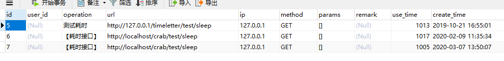

## 【AOP系列】一个切面类搞定请求日志

### 后端开发过程中接口调用的日志

### 折腾了又折腾，改了又改，怎么弄都弄不好？

试试这个

依赖

```xml
<!--SpringBoot-aop   HttpLogAspect类依赖-->
<dependency>
    <groupId>org.springframework.boot</groupId>
    <artifactId>spring-boot-starter-aop</artifactId>
</dependency>
```

效果


<!--more-->

HttpLogAspect.java

```java
import lombok.extern.slf4j.Slf4j;
import org.aspectj.lang.JoinPoint;
import org.aspectj.lang.ProceedingJoinPoint;
import org.aspectj.lang.annotation.*;
import org.springframework.beans.factory.annotation.Autowired;
import org.springframework.stereotype.Component;
import org.springframework.web.context.request.RequestContextHolder;
import org.springframework.web.context.request.ServletRequestAttributes;

import javax.servlet.http.HttpServletRequest;
import java.util.Arrays;
import java.util.Date;

@Slf4j
@Aspect
@Component
public class HttpLogAspect {

    @Pointcut("execution(* 【包名】.controller.*.*(..))")//拦截所有Controller类的方法
    public void log() {
    }
    @Before("log()")
    public void doBefore(JoinPoint joinPoint) {
        HttpServletRequest request = ((ServletRequestAttributes) RequestContextHolder.getRequestAttributes()).getRequest();
        String packClassName = joinPoint.getSignature().getDeclaringTypeName();
        String className = joinPoint.getSignature().getDeclaringType().getSimpleName();
        String method = joinPoint.getSignature().getName();
        System.out.println();
        log.info("URL={}", request.getRequestURL());
        log.info("Method={}", request.getMethod());
        log.info("IP={}", request.getRemoteAddr());
        log.info("Class.Method={}", packClassName + "." + method + "(" + className + ".java:1)");
        log.info("ContentType={}", request.getContentType());
        log.info("Args={}", joinPoint.getArgs());
    }
    
     @After("log()")
    public void doAfter() {
    }
    @AfterReturning(returning = "response", pointcut = "log()")
    public void doAfterReturning(Object response) {
        log.debug("response={}", response);
    }


}
```


### 耗时接口插入数据库？

```java
 	@Autowired
    SysLogMapper sysLogMapper;
    @Around("log()")
    public Object doAround(ProceedingJoinPoint point) {
        long beginTime = System.currentTimeMillis();
        try {
            return point.proceed();//放行操作
        } catch (Throwable throwable) {
            log.error(throwable.getMessage());
            return Result.getErrorResult("后台ERROR:" + throwable.getMessage());
            //return返回错误信息即可，本文没有提供Result类，自己处理即可。
        }finally {

            long time = System.currentTimeMillis() - beginTime;
            log.info("请求耗时={}", time);

            if (time>1000){//接口耗时超过1秒钟  加入日志到数据库
                HttpServletRequest request = ((ServletRequestAttributes) RequestContextHolder.getRequestAttributes()).getRequest();
                String operation = "【耗时接口】";
                SysLog sysLog = new SysLog();
                sysLog.setOperation(operation);
                sysLog.setUrl(request.getRequestURL().toString());
                sysLog .setIp(request.getRemoteAddr());
                sysLog.setMethod(request.getMethod());
                sysLog.setParams(Arrays.toString(point.getArgs()));
                sysLog.setUseTime(time);
                sysLog.setCreateTime(new Date());
                sysLogMapper.insert(sysLog);
                log.info("耗时接口已加入日志");
            }

            //【知识点】finally 会在 try 和catch 的return语句之前执行，
            //如果finally内又return,try和catch里的return不生效

        }
    }
```


### 测试

写个测试接口


数据库记录




```json
{
	"author": "大火yzs",
	"title": "【AOP系列】一个切面类搞定请求日志",
	"tag": "AOP,日志,切面工具类",
	"createTime": "2020-03-07  15:08"
}
```

