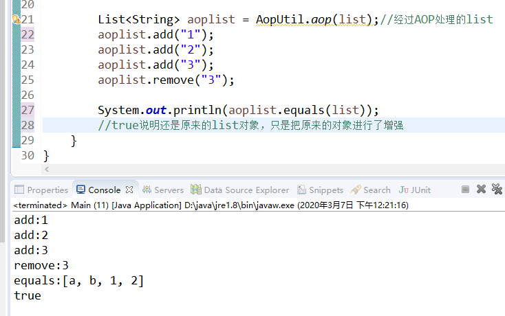

## 【AOP系列】爱之初体验(一)


### 前言

在java开发的面试过程中少不了会问道Spring框架

然鹅 Spring框架最基本的两个功能就是IOC和AOP。

本文就直说AOP


### AOP是啥?

> AOP红酒是法国红酒等级中最高的一级，属于顶级酒。AOP红酒就是原来的AOC红酒。
>
> 2010法国葡萄酒新等级——AOC已成为历史，2009年10月的时候，法国国家葡萄酒行业协会新闻公报报道称，为了配合欧洲葡萄酒的级别标注形式，AOC葡萄酒(法定产区葡萄酒)变成AOP葡萄酒

不好意思复制错了  **- _ -** `

<!--more-->

> AOP为Aspect Oriented Programming的缩写，是[面向切面编程](https://www.baidu.com/s?wd=面向切面编程&tn=SE_PcZhidaonwhc_ngpagmjz&rsv_dl=gh_pc_zhidao)，通过预编译方式和运行期动态代理实现程序功能的统一维护的一种技术。AOP是OOP的延续，是软件开发中的一个热点，也是Spring框架中的一个重要内容，是函数式编程的一种衍生范型。
>
> AOP的出现弥补了OOP的这点不足，AOP 是一个概念，一个规范，本身并没有设定具体语言的实现，AOP是基于动态代理模式。AOP是方法级别的，要测试的方法不能为static修饰，因为接口中不能存在静态方法，编译就会报错。
>
> AOP可以分离业务代码和关注点代码（重复代码），在执行业务代码时，动态的注入关注点代码。切面就是关注点代码形成的类。Spring AOP中的动态代理主要有两种方式，JDK动态代理和CGLIB动态代理。JDK动态代理通过反射来接收被代理的类，并且要求被代理的类必须实现一个接口。

**哦，看了一大堆，到底想说啥？**


### List在增删改查的时候,在控制台上输出一条记录怎么实现？

```java
		List<String> list = new ArrayList<>();
		list.add("a");
		System.out.println("add:a");
		list.add("b");
		System.out.println("add:b");
		list.add("c");
		System.out.println("add:c");
		list.remove("c");
		System.out.println("remove:c");
```

#### 写好了 - _ - ~


那么看看AOP的方式实现

AopUtil.java

```java
import java.lang.reflect.InvocationHandler;
import java.lang.reflect.Method;
import java.lang.reflect.Proxy;
import java.util.List;

public class AopUtil {

	public static List aop(List list){
		return (List)Proxy.newProxyInstance(null, new Class[]{List.class}, new Log(list));
	}
	
	static class Log implements InvocationHandler{
		Object target;	
		public Log(Object obj){
			this.target=obj;
		}
		@Override
		public Object invoke(Object proxy, Method method, Object[] args) throws Throwable {
			System.out.print(method.getName()+":");
			for (Object object : args) {
				System.out.print(object);
			}
			System.out.println();
			Object o=method.invoke(target, args);
			return o;
		}
	}
}
```


```java
public class Main {
	public static void main(String[] args) throws Throwable{
		//原来写法
		List<String> list = new ArrayList<>();
		list.add("a");
		System.out.println("add:a");
		list.add("b");
		System.out.println("add:b");
		list.add("c");
		System.out.println("add:c");
		list.remove("c");
		System.out.println("remove:c");
		
		List<String> aoplist = AopUtil.aop(list);//经过AOP处理的list
		aoplist.add("1");
		aoplist.add("2");
		aoplist.add("3");
		aoplist.remove("3");
		
		System.out.println(aoplist.equals(list));
		//true说明还是原来的list对象，只是把原来的对象进行了增强
	}
}
```




**鹅 美 净~	(amazeing)**

经过AOP动态代理处理后我们原来的List就有了，输出的功能。


### AOP具体运用在什么地方呢？

日志记录，性能统计，安全控制，事务处理，异常处理等很多地方都会用到。


```json
{
	"author": "大火yzs",
	"title": "【AOP系列】爱之初体验",
	"tag": "AOP,List,日志",
	"createTime": "2020-03-07  13:10"
}
```

