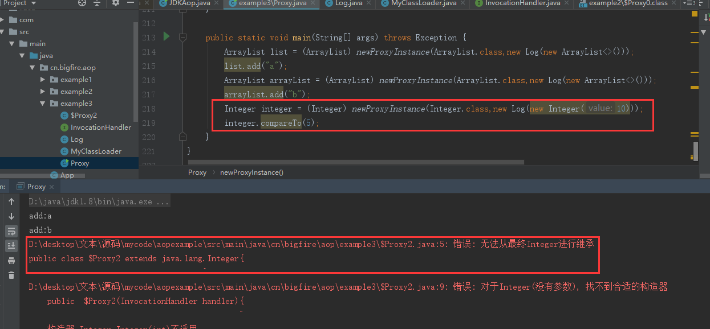
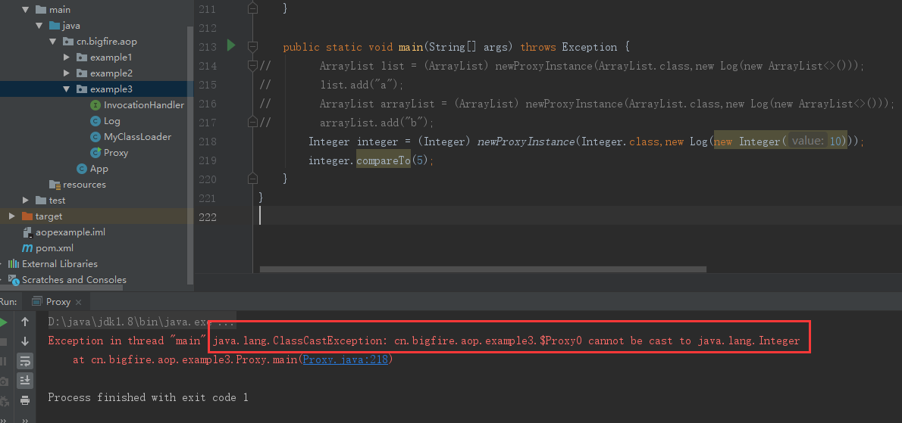

## 【AOP系列】自己动手实现一个JDK的Proxy类(四)


### 思路：

1.通过反射拿到一个类的Class对象。然后调用getMethods()方法。

2.拿到要代理类的方法后，可以得到原方法的所有信息，如(方法访问标识符，方法返回值，方法名称，方法参数)

3.可以使用字符串的形式拼接出原来的方法，并在方法前和方法后加入自己的代码逻辑。

4.把拼接好的代理类写入到一个Java文件中。这样我们就生成了代理的类。(有点像代码生成器)

5.编译这个.java的文件。并生成对应的class文件。

6.使用类加载器加载生成的class类。并返回。此时的对象，在拼接的时候已经对原有方法进行了增强。

<!--more-->

### 实现

#### InvocationHandler.java

```
public interface InvocationHandler {
    Object invoke(Method method, Object... args)throws Throwable;
}
```

注意，我们写的这个接口和JDK的区别，少了第一个参数Object  target


#### Log.java

```
public class Log implements InvocationHandler {

    Object target;//要代理的对象

    public Log(Object obj){
        this.target=obj;
    }

    @Override
    public Object invoke(Method method, Object[] args) throws Throwable {
        //打印方法名
        System.out.print(method.getName()+":");
        //打印参数
        for (Object object : args) {
            System.out.print(object);
        }
        //换行
        System.out.println();
        //调用原对象的方法
        Object o=method.invoke(target, args);
        //这里也可以在方法调用完之后插入一些逻辑
        return o;
    }

}
```

写一个类实现上面的接口，并在invoke前添加输出语句。

由于自己写Proxy类的实现，需生成byte[]加载到内存，需要自己定义ClassLoder，so

#### MyClassLoader.java

```java
public class MyClassLoader extends ClassLoader {

    //指定路径
    private String classPath;
	//构造函数
    public MyClassLoader(String classPath){
        this.classPath =classPath;
    }

    /**
     * 重写findClass方法
     * @param name 是我们这个类的全路径
     * @return
     * @throws ClassNotFoundException
     */
    @Override
    protected Class<?> findClass(String name) throws ClassNotFoundException {
        Class clazz = null;
        // 获取该class文件字节码数组
        byte[] classData = getData();
        if (classData != null) {
            // 将class的字节码数组转换成Class类的实例
            clazz = defineClass(name, classData, 0, classData.length);
        }
        return clazz;
    }

    /**
     * 将class文件转化为字节码数组
     * @return
     */
    private byte[] getData() throws ClassNotFoundException {
        File file = new File(classPath);
        if (!file.exists())throw new ClassNotFoundException();
        FileInputStream inputStream = null;
        try {
            inputStream = new FileInputStream(file);
            ByteArrayOutputStream outputStream = new ByteArrayOutputStream();
            byte[] buffer = new byte[1024];
            int size;
            while ((size = inputStream.read(buffer)) != -1) {
                outputStream.write(buffer, 0, size);
            }
            return outputStream.toByteArray();
        } catch (Exception e) {
            e.printStackTrace();
        }finally {
            try {
                inputStream.close();
            } catch (IOException e) {
                e.printStackTrace();
            }
        }
        return null;
    }
}
```


#### 最后是最重要的Proxy类

```java
public class Proxy {

    //当前项目目录
    private static String userDir = System.getProperty("user.dir");
    //当前包
    private static String pack = Proxy.class.getPackage().getName();
    private static String packPath = pack.replace(".","/");
    //环境目录
    private static String envDir = "/src/main/java/";
    //当前包的绝对路径
    private static String currPackPath = userDir  + envDir + packPath;

    // 所有代理类名的前缀(模拟JDK中的命名)
    private static final String proxyClassNamePrefix = "$Proxy";
    // 下一个用于生成唯一代理类名的数字，用于生成代码类名 $Proxy  + 自增号(模拟JDK中的命名)
    private static final AtomicLong nextUniqueClassNumber = new AtomicLong();
    // 在生成代码过程中，由于会生成大量参数，命名较为繁琐，使用(arg + 自增号)命名
    private static final AtomicLong nextUniqueArgsNumber = new AtomicLong();

    /**
     * 生成代码类(仅支持接口类型)
     *
     * @param clazz   需要代理的接口类
     * @param handler 已经实现了InvocationHandler接口的实体类
     */
    public static Object newProxyInstance(Class clazz, InvocationHandler handler) throws Exception {
        //换行
        String rt = "\r\n";
        //接口名称
        String interfaceName = clazz.getName();
        //生成代码类名      $Proxy  + 自增号
        String className = proxyClassNamePrefix + nextUniqueClassNumber.getAndIncrement();
        //类所在包
        String packCode = "package " + pack + ";" + rt + rt;
        //导包代码
        String importMethod = "import java.lang.reflect.Method;" + rt + rt;
        //类的关系
        String relation = (clazz.isInterface() ? " implements " : " extends ") + interfaceName;
//        String relation = clazz.isInterface() ? " implements " + interfaceName : " ";
        //class类定义代码
        String clazzCode = "public class " + className + relation + "{" + rt;
        //属性
        String fieldCode = "    InvocationHandler handler;" + rt;
        //构造方法
        String constructorCode = "    public  " + className + "(InvocationHandler handler){" + rt;
        //构造方法内的代码
        String innerCode1 = "        this.handler = handler;" + rt;
        //构造方法结束
        String right = "    }" + rt;
        //拼接 前面的代码
        String header = packCode
                + importMethod
                + clazzCode
                + rt
                + fieldCode
                + rt
                + constructorCode
                + innerCode1
                + right
                + rt;
        //用于拼接代理类的方法代码
        StringBuilder builder = new StringBuilder(header);
        //通过反射拿到代理类接口的所有方法
        Method[] methods = clazz.getMethods();
        //便利每一个方法，并代理每一个方法
        Stream.of(methods).forEach(method -> {
            //方法名
            String methodName = typeOf(method.getName());
            int modifier = method.getModifiers();
            if (Modifier.isNative(modifier)||Modifier.isFinal(modifier)) {
                //如果是Native方法则不代理。
            } else {
                //方法返回值类型
                String returnName = typeOf(method.getReturnType().getName());
                //方法参数列表
                Class<?>[] parameterTypes = method.getParameterTypes();
                //用于拼接形参列表
                String formalArgs = "";
                //用于拼接实参列表
                String realArgs = "";
                //用于拼接实参Class类型的字符串
                String realArgsClass = "";
                //便利参数列表，并拼接出上面三个参数
                for (int i = 0; i < parameterTypes.length; i++) {
                    //参数类型
                    String parameterTypeName = typeOf(parameterTypes[i].getName());

                    //参数名 arg0,arg1,arg2,arg3  ...
                    String argName = "arg" + nextUniqueArgsNumber.getAndIncrement();
                    //形参   Object arg0,String arg1,Integer arg2  ...
                    formalArgs += (parameterTypeName + " " + argName);
                    realArgs += argName;
                    realArgsClass += parameterTypeName + ".class";
                    //如果不是最后一个都加上个","  如果最后一个就不再添加","
                    if (i != (parameterTypes.length - 1)) {
                        formalArgs += ",";
                        realArgs += ",";
                        realArgsClass += ",";
                    }
                }
                //如果参数长度为0，那么传null
                String arg = parameterTypes.length > 0 ? realArgs : "new Object()";
                //拼接方法体代码
                String methodStr = clazz.isInterface() ?   "    @Override" + rt : "";
                methodStr += ("    public " + returnName + " " + methodName + "(" + formalArgs + "){" + rt);
                methodStr += ("        try{ " + rt);
                methodStr += ("            Method method = " + interfaceName + ".class.getMethod(\"" + methodName + "\"");
                //根据参数长度，确定是否添加参数
                if (parameterTypes.length > 0) {
                    methodStr += ("," + realArgsClass);
                }
                methodStr += (");" + rt);
                //返回值 如果为"void"，则生成没有返回值的方法调用
                if (returnName.equals("void")) {
                    methodStr += ("            handler.invoke(method," + arg + ");" + rt);
                } else {
                    methodStr += ("            return (" + returnName + ")handler.invoke(method," + arg + ");" + rt);
                }
//            System.out.println(methodStr);
                //捕获所有异常，转换成RuntimeException异常
                methodStr += ("        }catch (Throwable e){e.printStackTrace();throw new RuntimeException(e.getMessage());}" + rt + right + rt);
                //代理对象的一个方法代码拼接完成，与原有代码拼接在一起
                builder.append(methodStr);
            }
        });
        builder.append("}");
        //代理类的所有代码拼接完成
        String code = builder.toString();


        String javaFileName = userDir + envDir + packPath + "/" + className + ".java";
        File javaFile = new File(javaFileName);
        String classFileName = userDir + envDir + packPath + "/" + className + ".class";
        File classFile = new File(classFileName);

        //写入代码
        FileWriter fileWriter = new FileWriter(new File(javaFileName));
        fileWriter.write(code);
        fileWriter.close();

        //运行时编译器  编译代理类的Java源代码代码->class文件
        JavaCompiler javaCompiler = ToolProvider.getSystemJavaCompiler();
        StandardJavaFileManager fileManager = javaCompiler.getStandardFileManager(null, null, null);
        Iterable<? extends JavaFileObject> javaFileObjects = fileManager.getJavaFileObjects(javaFileName);
        JavaCompiler.CompilationTask task = javaCompiler.getTask(null, fileManager, null, null, null, javaFileObjects);
        task.call();
        fileManager.close();

        //使用自定义ClassLoader加载Class类
        String packet = pack + "." + className;
        MyClassLoader myClassLoader = new MyClassLoader(classFileName);
        Class<?> targetProxy = myClassLoader.findClass(packet);

        //使用反射创建代理类对象
        Constructor constructor = targetProxy.getConstructor(InvocationHandler.class);
        Object object = constructor.newInstance(handler);

        //删除操作时生成的Java源代码和Class文件
        if (javaFile.exists()) javaFile.delete();
//        if (classFile.exists())classFile.delete();
        return object;
    }

    public static String typeOf(String className) {
        //如果是数组类型，则转换
        if (className.startsWith("[")) {
            //如果是对象数组
            if (className.startsWith("[L"))
                return className.substring(2, className.length() - 1) + "[]";
            //如果是Java8种基础类型
            if (className.startsWith("[S"))
                return "short[]";
            if (className.startsWith("[B"))
                return "byte[]";
            if (className.startsWith("[C"))
                return "char[]";
            if (className.startsWith("I"))
                return "int[]";
            if (className.startsWith("[J"))
                return "long[]";
            if (className.startsWith("[F"))
                return "float[]";
            if (className.startsWith("[D"))
                return "double[]";
            if (className.startsWith("[Z"))
                return "boolean[]";
        }
        //否则普通类型，不做转换
        return className;
    }

    public static void main(String[] args) throws Exception {
        ArrayList list = (ArrayList) newProxyInstance(ArrayList.class,new Log(new ArrayList<>()));
        list.add("a");
        ArrayList arrayList = (ArrayList) newProxyInstance(ArrayList.class,new Log(new ArrayList<>()));
        arrayList.add("a");
//        Integer integer = (Integer) newProxyInstance(Integer.class,new Log(new Integer(10)));
//        integer.compareTo(5);
    }
}
```

OK写完了。代码有点长。写的有点乱了。没有整理，把很多东西都放在一个方法里了。


其实不难发现这里的实现方式，和JDK的还是有一些不一样的。
JDK是直接根据class文件的格式直接构造class类型的byte[],
由于Class文件结构较为复杂，
**而这里则是先用字符串拼接一个Java文件，**
**再用JavaCompiler去编译这个java文件。生成一个class文件。**
**再通过MyClassLoader把这个生成好的class文件Load到内存。得到Class对象。**
虽然实现方式不同，但是最终目的效果是差不多的。


### 运行结果


### 连ArrarList都能被代理了？？？

**不是说JDK的Proxy代理只能代理接口吗。为啥ArrayList都能被代理了。**

思考。

### 为啥$Proxy0一定要继承Proxy呢？

在代理类中，与Proxy有关的只有Proxy的变量protected InvocationHandler h;这个InvocationHandler实例的引用，在调用接口方法时实际调用的是super.h.invoke(this, method, args)， 如果仅仅为了这个变量，完全可以通过别的方法传过去。

既然我不知道为啥一定要继承这个Proxy。那我自己实现时我就不继承Proxy了。这样我生成的代理类就可以继承其他类了。既然可以继承其他类。那是不是就实现了对类的代理？

注意这两行代码。

```java
String relation = (clazz.isInterface() ? " implements " : " extends ") + interfaceName;
//class类定义代码
String clazzCode = "public class " + className + relation + "{" + rt;
```

className我依然模仿了JDK的命名方式$Proxy+递增序号，而继承关系则是，根据接口的类型不同，选择是实现，还是继承。这样我的Proxy就可以 支持普通类的代理了。虽然看上去，上面已经实现了对List接口和ArrayList类的动态代理。但是真的就没问题吗？真的就可以代理所有的接口和类了吗?

注意Proxy类中的这一行代码

```java
String relation = (clazz.isInterface() ? " implements " : " extends ") + interfaceName;
```

如果是接口用implements 否则是类则extends，下面我们使用上面的Proxy尝试去代理Integer类。


### 尝试代理Integer类。




**他说Integer是被final修饰过的。就是说被final定义的类是无法代理的；**


#### 一个错误的思路

其实我们可以换个思路。既然不能被继承，那我们就不继承，只把原来类中的方法重新实现一遍不就好了吗？

生成代理类的时候直接不继承，而是把Integer类的所有方法实现一遍。反正都是动态生成的。

好的，那我们试试。把

```
String relation = (clazz.isInterface() ? " implements " : " extends ") + interfaceName;
```

注释掉，换成

```
String relation = clazz.isInterface() ? " implements " + interfaceName : " ";
```

这样的语义是：如果是接口的话就实现。如果不是接口的话，就不做任何处理，只是生成对应一模一样的方法。

再次运行



现在清楚了，虽然生成了一模一样的类，但是现在就不算代理了，因为两个类已经没啥联系了，所以生成的Proxy类当然不能转换成Integer了


### 思考

JDK为啥不能实现普通类的动态代理？

因为生成的代理类继承Proxy，(这是网上很多人给的答案)

但是$Proxy0为啥要继承Proxy呢?   

或许$Proxy0也可以不继承Proxy其实也是不影响的。（学术浅薄，仅仅猜测）。**-_-~**


不好意思，大佬们。在此对这个问题提出质疑。

[JDK动态代理为什么不能代理类](https://blog.csdn.net/u012796139/article/details/102577724)       作者:[luoxn28](https://blog.csdn.net/u012796139)

[jdk的动态代理及为什么需要接口](https://blog.csdn.net/zxysshgood/article/details/78684229#commentBox)    作者:[XyGoodCode](https://blog.csdn.net/zxysshgood)

[jdk的动态代理及为什么需要接口](https://blog.csdn.net/linglingma9087/article/details/80311518)    作者:[可爱马莲花](https://blog.csdn.net/linglingma9087)


或许是JDK的设计者们是这样考虑的？？


因为无法知道被代理的类是否被final修饰了。如果被final修饰了，就实现不了代理。

而接口是不能被final关键字修饰的。

> 注意  接口中成员变量已默认是final了，而接口的定义和方法的定义是不能被final修饰的。


参考文章

[java动态代理原理及解析](https://blog.csdn.net/Scplove/article/details/52451899)              作者:[简单世界](https://blog.csdn.net/Scplove)

[Java 动态代理机制分析及扩展](https://www.ibm.com/developerworks/cn/java/j-lo-proxy1/index.html)       作者:王忠平和何平

[JDK 动态代理分析](https://www.cnblogs.com/cruze/p/3819761.html)        					作者:沉木


```json
{
	"author": "大火yzs",
	"title": "【AOP系列】自己动手实现一个JDK的Proxy类",
	"tag": "AOP,List,JDK动态代理",
	"createTime": "2020-03-23  1:35"
}
```

