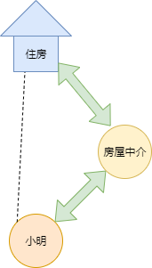
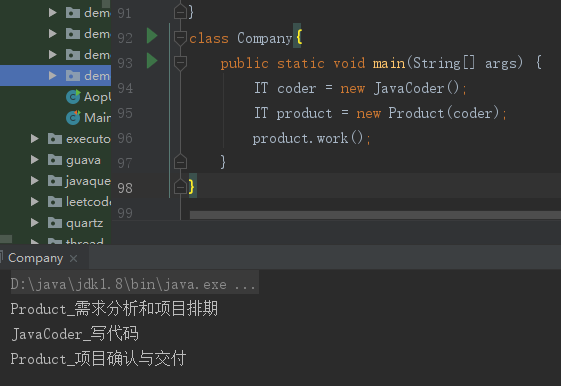
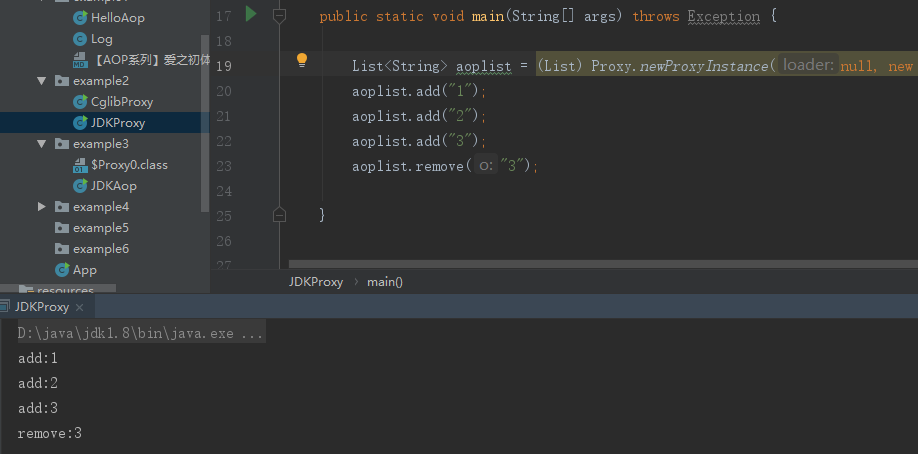
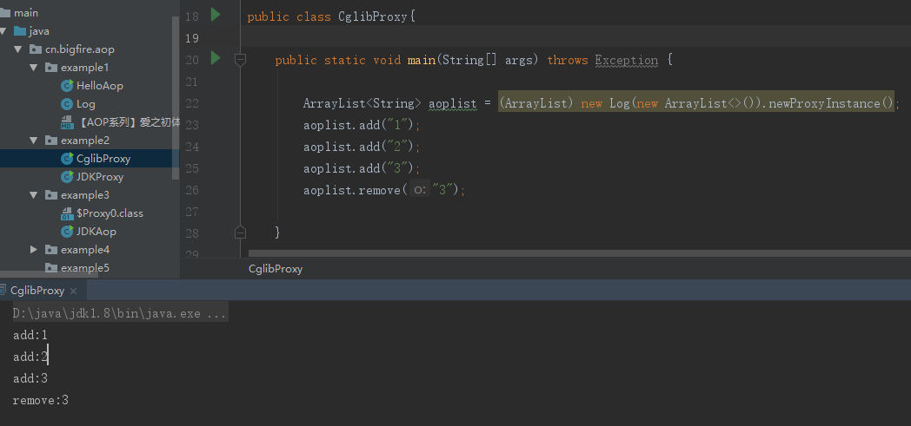

## 【AOP系列】静态代理和动态代理(二)


### 什么是代理？

> 代理(Proxy)是一种设计模式,提供了间接对目标对象进行访问的方式;即通过代理对象访问目标对象.这样做的好处是:可以在目标对象实现的功能上,增加额外的功能补充,即扩展目标对象的功能.
>
> 这就符合了设计模式的开闭原则，即在对既有代码不改动的情况下进行功能的扩展。


代理是英文 Proxy 翻译过来的。我们在生活中见到过的代理，大概最常见的就是朋友圈里的房屋中介了

他们骑着电动车穿梭在各个小区之间，带人看房。这里举个例子，小明要租一个房子，但由于一些原因，自己不呢个获得很多有效的房屋信息。所以只好找到房屋中介，让他们带着自己看房子。



其中这里面的房屋中介，差不多就有点代理的意思

接下来我们来看看软件中的几种代理方式。


<!--more-->
### 静态代理

#### 代码实例：

```
//IT部门
interface IT {
    void work();
}
//Java程序员
class JavaCoder implements IT {
    @Override
    public void work() {
        System.out.println("JavaCoder_写代码");
    }
}
//产品经理
class Product implements IT {
    private IT coder;
    public Product(IT coder) {
        this.coder = coder;
    }
    @Override
    public void work() {
        System.out.println("Product_需求分析和项目排期");
        coder.work();
        System.out.println("Product_项目确认与交付");
    }
}

class Company{
    public static void main(String[] args) {
        IT coder = new JavaCoder();
        IT product = new Product(coder);
        product.work();
    }
}
```

运行效果




#### 静态代理总结:

##### 优点：

​		可以做到在不修改目标对象的功能前提下,对目标功能扩展.

##### 缺点:

　　因为代理对象需要与目标对象实现一样的接口,所以会有很多代理类,类太多.同时,一旦接口增加方法,目标对象与代理对象都要维护.

而动态代理方式可以解决上面的问题


### JDK动态代理

动态代理的主要特点就是能够在程序运行时JVM才为被代理对象生成代理对象(Java Agent可实现JVM层面的AOP功能,不在本文介绍之内)

常说的动态代理也叫做JDK代理也是一种接口代理，JDK中生成代理对象的代理类就是Proxy，所在包是java.lang.reflect

#### JDKProxy.java

```java
public class JDKProxy {

    public static void main(String[] args) throws Exception {

        List<String> aoplist = (List) Proxy.newProxyInstance(null, new Class[]{List.class}, new Log(new ArrayList<String>()));
        aoplist.add("1");
        aoplist.add("2");
        aoplist.add("3");
        aoplist.remove("3");

    }

    static class Log implements InvocationHandler {

        Object target;//要代理的对象

        public Log(Object obj){
            this.target=obj;
        }

        @Override
        public Object invoke(Object proxy, Method method, Object[] args) throws Throwable {
            //打印方法名
            System.out.print(method.getName()+":");
            //打印参数
            for (Object object : args) {
                System.out.print(object);
            }
            //换行
            System.out.println();
            //调用原对象的方法
            Object object=method.invoke(target, args);
            //这里也可以在方法调用完之后插入一些逻辑
            return object;
        }

    }
}

```

#### 运行效果



#### 总结：

代理对象不需要实现接口,但是目标对象一定要实现接口,否则不能使用动态代理，因此这也算是这种方式的缺陷。


### Cglib的动态代理

上面的静态代理和动态代理模式有个相同点就是都要求目标对象是实现一个接口的对象,然而并不是任何对象都会实现一个接口，也存在没有实现任何的接口的对象,

这时就可以使用继承目标类以目标对象子类的方式实现代理,这种方法就叫做:Cglib代理，也叫作子类代理,它是在内存中构建一个子类对象从而实现对目标对象功能的扩展.

使用JDK动态代理有一个限制,就是被代理的对象必须实现一个或多个接口,若想代理没有实现接口的类,就需要使用Cglib实现.


Maven依赖

```xml
<dependency>
    <groupId>cglib</groupId>
    <artifactId>cglib</artifactId>
    <version>3.3.0</version>
</dependency>
```

#### CglibProxy.java

```java
public class CglibProxy{

    public static void main(String[] args) throws Exception {

        ArrayList<String> aoplist = (ArrayList) new Log(new ArrayList<>()).newProxyInstance();
        aoplist.add("1");
        aoplist.add("2");
        aoplist.add("3");
        aoplist.remove("3");

    }

    static class Log implements MethodInterceptor{
        
        Object target;//要代理的对象
        
        public Log(Object obj){
            this.target=obj;
        }
        
        @Override
        public Object intercept(Object o, Method method, Object[] objects, MethodProxy methodProxy) throws Throwable {
            //打印方法名
            System.out.print(method.getName()+":");
            //打印参数
            for (Object object : objects) {
                System.out.print(object);
            }
            //换行
            System.out.println();
            //调用原对象的方法
            Object object=method.invoke(target, objects);
            //这里也可以在方法调用完之后插入一些逻辑
            return object;
        }
        
        public Object newProxyInstance(){
            Enhancer enhancer = new Enhancer();
            //设置父类,因为Cglib是针对指定的类生成一个子类，所以需要指定父类
            enhancer.setSuperclass(target.getClass());
            enhancer.setCallback(this);// 设置回调
            Object result = enhancer.create();//创建并返回代理对象
            return result;
        }
    }
    
}

```

运行效果




### 总结：

Java的代理有两种：静态代理和动态代理。

动态代理又分为 两种：基于jdk的动态代理 和 基于cglib的动态代理 。

两者都是通过动态生成代理类的方法实现的，但是基于jdk的动态代理需要委托类实现接口，基于cglib的动态代理不要求委托类实现接口。


在Spring的AOP编程中:

如果加入容器的目标对象有实现接口,用JDK代理

如果目标对象没有实现接口,用Cglib代理。

```json
{
	"author": "大火yzs",
	"title": "【AOP系列】静态代理和动态代理",
	"tag": "AOP,List,日志",
	"createTime": "2020-03-07  13:10"
}
```

